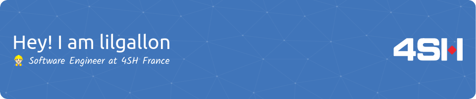

Former student of:
- 🇫🇷 Bordeaux Institute of Technology
- 🇫🇷 University of Bordeaux
- 🇺🇸 University of California, Santa Cruz.

I’ve got some experience in every domain of computer science . I am currently focusing on kotlin (couroutines and advanced features).

---

<h3>  Experiment: Dynamic LED Strips </h3>
                                                                                       
A C# software that connects **any** Bluetooth LED Strip to your computer using Bluetooth LE. The color and brightness then change according to your activity. [Dynamic Led Strips](https://github.com/lilgallon/DynamicLedStrips). A bit like *Philips Hue* but for any BLE-compatible device.

<h3>  My Minecraft Mods </h3>

  
  

<h3>  Developer of Dofus Mage Calculator </h3>

- 150 daily users: https://gallon.dev/dofus-tools/forgemagie.html
- 10k total users
- 100k impressions

---

  
:zap: Recent Github Activity

<!--START_SECTION:activity-->
1. 🎉 Merged PR [#10](https://github.com/lilgallon/HorseStatsMod/pull/10) in [lilgallon/HorseStatsMod](https://github.com/lilgallon/HorseStatsMod)
2. 🗣 Commented on [#10](https://github.com/lilgallon/HorseStatsMod/issues/10) in [lilgallon/HorseStatsMod](https://github.com/lilgallon/HorseStatsMod)
3. 🗣 Commented on [#10](https://github.com/lilgallon/HorseStatsMod/issues/10) in [lilgallon/HorseStatsMod](https://github.com/lilgallon/HorseStatsMod)
4. ❗️ Closed issue [#93](https://github.com/lilgallon/Bettercolors/issues/93) in [lilgallon/Bettercolors](https://github.com/lilgallon/Bettercolors)
5. 🗣 Commented on [#93](https://github.com/lilgallon/Bettercolors/issues/93) in [lilgallon/Bettercolors](https://github.com/lilgallon/Bettercolors)
<!--END_SECTION:activity-->

  
:zap: Github Stats

 

  
:zap: EVEN MORE statistics (since September 2020)

 

*Yeah, I like Windows*

---

<h3> Where to find me </h3>

Also lilian@gallon.dev
